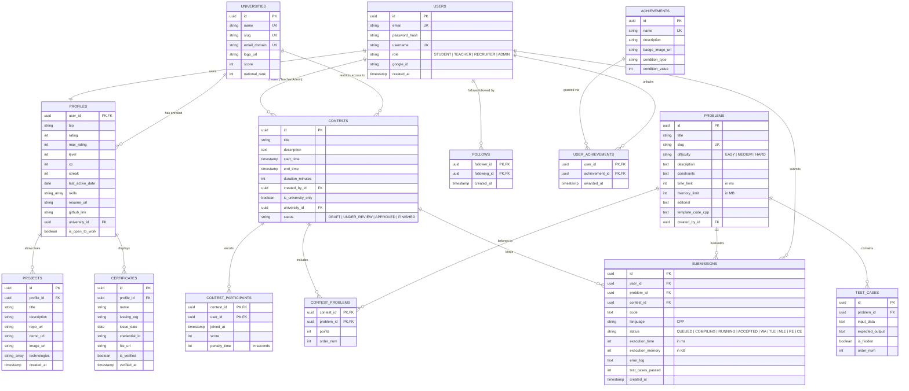

# Database Schema & ERD
## Project Name: "StudyMikey"
**Version**: 1.0.0  
**Author**: Principal Database Architect  
**Date**: June 3, 2026

---

## 1. Entity-Relationship Diagram (ERD)

This entity relationships map the system requirements using Postgres relations.



---

## 2. PostgreSQL DDL Schema (Neon Optimized)

The schema defines exact keys, indexes, foreign keys, cascade paths, and check constraints to preserve data consistency.

```sql
-- Enable UUID extension
CREATE EXTENSION IF NOT EXISTS "uuid-ossp";

-- ROLES ENUM
CREATE TYPE user_role AS ENUM ('STUDENT', 'TEACHER', 'RECRUITER', 'ADMIN');
-- CONTEST STATUS ENUM
CREATE TYPE contest_status AS ENUM ('DRAFT', 'UNDER_REVIEW', 'APPROVED', 'FINISHED');
-- SUBMISSION STATUS ENUM
CREATE TYPE submission_status AS ENUM ('QUEUED', 'COMPILING', 'RUNNING', 'ACCEPTED', 'WA', 'TLE', 'MLE', 'RE', 'CE');
-- DIFFICULTY ENUM
CREATE TYPE problem_difficulty AS ENUM ('EASY', 'MEDIUM', 'HARD');

-- 1. UNIVERSITIES TABLE
CREATE TABLE universities (
    id UUID PRIMARY KEY DEFAULT uuid_generate_v4(),
    name VARCHAR(255) NOT NULL UNIQUE,
    slug VARCHAR(100) NOT NULL UNIQUE,
    email_domain VARCHAR(100) NOT NULL UNIQUE,
    logo_url VARCHAR(500),
    score INT NOT NULL DEFAULT 0,
    national_rank INT NOT NULL DEFAULT 9999,
    created_at TIMESTAMP WITH TIME ZONE DEFAULT CURRENT_TIMESTAMP
);
CREATE INDEX idx_universities_score ON universities(score DESC);

-- 2. USERS TABLE
CREATE TABLE users (
    id UUID PRIMARY KEY DEFAULT uuid_generate_v4(),
    email VARCHAR(255) NOT NULL UNIQUE,
    password_hash VARCHAR(255),
    username VARCHAR(50) NOT NULL UNIQUE,
    role user_role NOT NULL DEFAULT 'STUDENT',
    google_id VARCHAR(255),
    created_at TIMESTAMP WITH TIME ZONE DEFAULT CURRENT_TIMESTAMP,
    updated_at TIMESTAMP WITH TIME ZONE DEFAULT CURRENT_TIMESTAMP
);
CREATE INDEX idx_users_email ON users(email);
CREATE INDEX idx_users_username ON users(username);

-- 3. PROFILES TABLE
CREATE TABLE profiles (
    user_id UUID PRIMARY KEY REFERENCES users(id) ON DELETE CASCADE,
    bio TEXT,
    rating INT NOT NULL DEFAULT 1200,
    max_rating INT NOT NULL DEFAULT 1200,
    level INT NOT NULL DEFAULT 1,
    xp INT NOT NULL DEFAULT 0,
    streak INT NOT NULL DEFAULT 0,
    last_active_date DATE DEFAULT CURRENT_DATE,
    skills TEXT[] DEFAULT '{}',
    resume_url VARCHAR(500),
    github_link VARCHAR(255),
    university_id UUID REFERENCES universities(id) ON DELETE SET NULL,
    is_open_to_work BOOLEAN NOT NULL DEFAULT false
);
CREATE INDEX idx_profiles_rating ON profiles(rating DESC);
CREATE INDEX idx_profiles_university_rating ON profiles(university_id, rating DESC);
CREATE INDEX idx_profiles_skills ON profiles USING gin(skills);

-- 4. PROJECTS TABLE (Showcases)
CREATE TABLE projects (
    id UUID PRIMARY KEY DEFAULT uuid_generate_v4(),
    profile_id UUID NOT NULL REFERENCES profiles(user_id) ON DELETE CASCADE,
    title VARCHAR(150) NOT NULL,
    description TEXT NOT NULL,
    repo_url VARCHAR(500),
    demo_url VARCHAR(500),
    image_url VARCHAR(500) NOT NULL, -- Cloudinary link
    technologies TEXT[] DEFAULT '{}',
    created_at TIMESTAMP WITH TIME ZONE DEFAULT CURRENT_TIMESTAMP
);
CREATE INDEX idx_projects_profile ON projects(profile_id);

-- 5. CERTIFICATES TABLE
CREATE TABLE certificates (
    id UUID PRIMARY KEY DEFAULT uuid_generate_v4(),
    profile_id UUID NOT NULL REFERENCES profiles(user_id) ON DELETE CASCADE,
    name VARCHAR(255) NOT NULL,
    issuing_org VARCHAR(255) NOT NULL,
    issue_date DATE NOT NULL,
    credential_id VARCHAR(100),
    file_url VARCHAR(500) NOT NULL, -- Cloudinary link
    is_verified BOOLEAN NOT NULL DEFAULT false,
    verified_at TIMESTAMP WITH TIME ZONE,
    CONSTRAINT chk_certificates_max CHECK (
        (SELECT count(*) FROM certificates WHERE profile_id = certificates.profile_id) <= 3
    )
);

-- 6. PROBLEMS TABLE
CREATE TABLE problems (
    id UUID PRIMARY KEY DEFAULT uuid_generate_v4(),
    title VARCHAR(255) NOT NULL,
    slug VARCHAR(255) NOT NULL UNIQUE,
    difficulty problem_difficulty NOT NULL DEFAULT 'MEDIUM',
    description TEXT NOT NULL,
    constraints TEXT,
    time_limit INT NOT NULL DEFAULT 2000, -- 2000ms default
    memory_limit INT NOT NULL DEFAULT 256, -- 256MB default
    editorial TEXT,
    template_code_cpp TEXT,
    created_by_id UUID NOT NULL REFERENCES users(id) ON DELETE RESTRICT,
    created_at TIMESTAMP WITH TIME ZONE DEFAULT CURRENT_TIMESTAMP,
    updated_at TIMESTAMP WITH TIME ZONE DEFAULT CURRENT_TIMESTAMP
);

-- 7. TEST CASES TABLE
CREATE TABLE test_cases (
    id UUID PRIMARY KEY DEFAULT uuid_generate_v4(),
    problem_id UUID NOT NULL REFERENCES problems(id) ON DELETE CASCADE,
    input_data TEXT NOT NULL,
    expected_output TEXT NOT NULL,
    is_hidden BOOLEAN NOT NULL DEFAULT true,
    order_num INT NOT NULL DEFAULT 0
);
CREATE INDEX idx_test_cases_problem ON test_cases(problem_id);

-- 8. CONTESTS TABLE
CREATE TABLE contests (
    id UUID PRIMARY KEY DEFAULT uuid_generate_v4(),
    title VARCHAR(255) NOT NULL,
    description TEXT,
    start_time TIMESTAMP WITH TIME ZONE NOT NULL,
    end_time TIMESTAMP WITH TIME ZONE NOT NULL,
    duration_minutes INT NOT NULL,
    created_by_id UUID NOT NULL REFERENCES users(id) ON DELETE RESTRICT,
    is_university_only BOOLEAN NOT NULL DEFAULT false,
    university_id UUID REFERENCES universities(id) ON DELETE SET NULL,
    status contest_status NOT NULL DEFAULT 'DRAFT',
    CONSTRAINT chk_contest_times CHECK (end_time > start_time)
);

-- 9. CONTEST PROBLEMS
CREATE TABLE contest_problems (
    contest_id UUID NOT NULL REFERENCES contests(id) ON DELETE CASCADE,
    problem_id UUID NOT NULL REFERENCES problems(id) ON DELETE CASCADE,
    points INT NOT NULL DEFAULT 100,
    order_num INT NOT NULL DEFAULT 0,
    PRIMARY KEY (contest_id, problem_id)
);

-- 10. SUBMISSIONS TABLE
CREATE TABLE submissions (
    id UUID PRIMARY KEY DEFAULT uuid_generate_v4(),
    user_id UUID NOT NULL REFERENCES users(id) ON DELETE CASCADE,
    problem_id UUID NOT NULL REFERENCES problems(id) ON DELETE CASCADE,
    contest_id UUID REFERENCES contests(id) ON DELETE SET NULL,
    code TEXT NOT NULL,
    language VARCHAR(10) NOT NULL DEFAULT 'CPP',
    status submission_status NOT NULL DEFAULT 'QUEUED',
    execution_time INT,
    execution_memory INT,
    error_log TEXT,
    test_cases_passed INT NOT NULL DEFAULT 0,
    created_at TIMESTAMP WITH TIME ZONE DEFAULT CURRENT_TIMESTAMP
);
CREATE INDEX idx_submissions_user ON submissions(user_id);
CREATE INDEX idx_submissions_problem ON submissions(problem_id);
CREATE INDEX idx_submissions_contest ON submissions(contest_id);

-- 11. CONTEST PARTICIPANTS
CREATE TABLE contest_participants (
    contest_id UUID NOT NULL REFERENCES contests(id) ON DELETE CASCADE,
    user_id UUID NOT NULL REFERENCES users(id) ON DELETE CASCADE,
    joined_at TIMESTAMP WITH TIME ZONE DEFAULT CURRENT_TIMESTAMP,
    score INT NOT NULL DEFAULT 0,
    penalty_time INT NOT NULL DEFAULT 0, -- in seconds
    PRIMARY KEY (contest_id, user_id)
);

-- 12. FOLLOWS TABLE (Social graph)
CREATE TABLE follows (
    follower_id UUID NOT NULL REFERENCES users(id) ON DELETE CASCADE,
    following_id UUID NOT NULL REFERENCES users(id) ON DELETE CASCADE,
    created_at TIMESTAMP WITH TIME ZONE DEFAULT CURRENT_TIMESTAMP,
    PRIMARY KEY (follower_id, following_id),
    CONSTRAINT chk_self_follow CHECK (follower_id <> following_id)
);

-- 13. ACHIEVEMENTS TABLE
CREATE TABLE achievements (
    id UUID PRIMARY KEY DEFAULT uuid_generate_v4(),
    name VARCHAR(100) NOT NULL UNIQUE,
    description TEXT NOT NULL,
    badge_image_url VARCHAR(500) NOT NULL,
    condition_type VARCHAR(50) NOT NULL, -- e.g., 'SOLVE_COUNT', 'CONTEST_RATING'
    condition_value INT NOT NULL
);

-- 14. USER ACHIEVEMENTS TABLE
CREATE TABLE user_achievements (
    user_id UUID NOT NULL REFERENCES users(id) ON DELETE CASCADE,
    achievement_id UUID NOT NULL REFERENCES achievements(id) ON DELETE CASCADE,
    awarded_at TIMESTAMP WITH TIME ZONE DEFAULT CURRENT_TIMESTAMP,
    PRIMARY KEY (user_id, achievement_id)
);
```

---

## 3. Drizzle ORM Schema Specification

For StudyMikey Next.js Integration, here is the `db/schema.ts` implementation mapping the DDL structure to TypeScript.

```typescript
import {
  pgTable,
  uuid,
  varchar,
  text,
  integer,
  boolean,
  timestamp,
  date,
  primaryKey,
  pgEnum,
} from "drizzle-orm/pg-core";
import { relations } from "drizzle-orm";

// Enums
export const roleEnum = pgEnum("role", ["STUDENT", "TEACHER", "RECRUITER", "ADMIN"]);
export const contestStatusEnum = pgEnum("contest_status", ["DRAFT", "UNDER_REVIEW", "APPROVED", "FINISHED"]);
export const submissionStatusEnum = pgEnum("submission_status", [
  "QUEUED", "COMPILING", "RUNNING", "ACCEPTED", "WA", "TLE", "MLE", "RE", "CE"
]);
export const difficultyEnum = pgEnum("difficulty", ["EASY", "MEDIUM", "HARD"]);

// Universities Table
export const universities = pgTable("universities", {
  id: uuid("id").primaryKey().defaultRandom(),
  name: varchar("name", { length: 255 }).notNull().unique(),
  slug: varchar("slug", { length: 100 }).notNull().unique(),
  emailDomain: varchar("email_domain", { length: 100 }).notNull().unique(),
  logoUrl: varchar("logo_url", { length: 500 }),
  score: integer("score").default(0).notNull(),
  nationalRank: integer("national_rank").default(9999).notNull(),
  createdAt: timestamp("created_at", { withTimezone: true }).defaultNow(),
});

// Users Table
export const users = pgTable("users", {
  id: uuid("id").primaryKey().defaultRandom(),
  email: varchar("email", { length: 255 }).notNull().unique(),
  passwordHash: varchar("password_hash", { length: 255 }),
  username: varchar("username", { length: 50 }).notNull().unique(),
  role: roleEnum("role").default("STUDENT").notNull(),
  googleId: varchar("google_id", { length: 255 }),
  createdAt: timestamp("created_at", { withTimezone: true }).defaultNow(),
  updatedAt: timestamp("updated_at", { withTimezone: true }).defaultNow(),
});

// Profiles Table
export const profiles = pgTable("profiles", {
  userId: uuid("user_id").primaryKey().references(() => users.id, { onDelete: "cascade" }),
  bio: text("bio"),
  rating: integer("rating").default(1200).notNull(),
  maxRating: integer("max_rating").default(1200).notNull(),
  level: integer("level").default(1).notNull(),
  xp: integer("xp").default(0).notNull(),
  streak: integer("streak").default(0).notNull(),
  lastActiveDate: date("last_active_date").defaultNow(),
  skills: text("skills").array().default([]),
  resumeUrl: varchar("resume_url", { length: 500 }),
  githubLink: varchar("github_link", { length: 255 }),
  universityId: uuid("university_id").references(() => universities.id, { onDelete: "set null" }),
  isOpenToWork: boolean("is_open_to_work").default(false).notNull(),
});

// Projects Table
export const projects = pgTable("projects", {
  id: uuid("id").primaryKey().defaultRandom(),
  profileId: uuid("profile_id").notNull().references(() => profiles.userId, { onDelete: "cascade" }),
  title: varchar("title", { length: 150 }).notNull(),
  description: text("description").notNull(),
  repoUrl: varchar("repo_url", { length: 500 }),
  demoUrl: varchar("demo_url", { length: 500 }),
  imageUrl: varchar("image_url", { length: 500 }).notNull(),
  technologies: text("technologies").array().default([]),
  createdAt: timestamp("created_at", { withTimezone: true }).defaultNow(),
});

// Certificates Table
export const certificates = pgTable("certificates", {
  id: uuid("id").primaryKey().defaultRandom(),
  profileId: uuid("profile_id").notNull().references(() => profiles.userId, { onDelete: "cascade" }),
  name: varchar("name", { length: 255 }).notNull(),
  issuingOrg: varchar("issuing_org", { length: 255 }).notNull(),
  issueDate: date("issue_date").notNull(),
  credentialId: varchar("credential_id", { length: 100 }),
  fileUrl: varchar("file_url", { length: 500 }).notNull(),
  isVerified: boolean("is_verified").default(false).notNull(),
  verifiedAt: timestamp("verified_at", { withTimezone: true }),
});
```

---

## 4. Redis Schema (Cache and Queuing Structures)

Redis sits in front of Neon DB to optimize database compute, handles real-time leaderboards, and drives the judge pipeline.

| Keyspace | Data Type | Expiry | Use Case |
| :--- | :--- | :--- | :--- |
| `user:session:{userId}` | String | 24 Hours | Storing JWT session state or revoking tokens |
| `contest:leaderboard:{contestId}` | ZSET | None | Dynamic contest leaderboards (`score` and `penalty_time` combined to generate ranking metrics) |
| `national:leaderboard` | ZSET | 1 Hour | Rank universities by global calculated score |
| `problem:editorial:{problemSlug}` | String | 12 Hours | Cache for heavy markdown problem text / editorials |
| `judge:queue` | List (Queue) | None | FIFO queue for C++ sandboxing (`BullMQ` core) |
| `judge:status:{submissionId}` | Hash | 30 Mins | Fast lookup for compiler status updates (checked by long polling / WebSockets) |

### 4.1 Redis ZSET (Sorted Set) Contest Scoring Logic
Contest score rankings are saved in `contest:leaderboard:{contestId}`. The sorted set processes scores using floating point values to accommodate tiebreakers:
*   **Integer part of value**: The total points or problems solved (e.g., `4`).
*   **Decimal part of value**: Reciprocal of penalty time (e.g., $1 - \frac{\text{Penalty Seconds}}{86400}$). 
*   **Resulting Score**: `4.99583` (higher score gets ranked higher, meaning more problems solved with lower penalty time).
*   **Query**: `ZREVRANGEBYSCORE contest:leaderboard:123 +inf -inf LIMIT 0 100` retrieves the top 100 ranks.

---

## 5. Security & Isolation Design (Database Level)

1.  **Row-Level Security (RLS)**: Enforced on the `profiles` table to prevent students from toggling `is_verified` metrics without admin routes, and preventing recruiters from accessing profiles without setting `is_open_to_work` or user-explicit recruiter consent.
2.  **Connection Throttling**: Configure Neon's proxy limits to protect the DB from connection spikes when serverless API functions scale. 
3.  **Sanitization Trigger**: Use native PostgreSQL triggers to sanitize markdown inputs for problems, bios, and comments using pg_trgm and custom regex validation blocks to prevent cross-site scripting (XSS) at the persistence tier.
