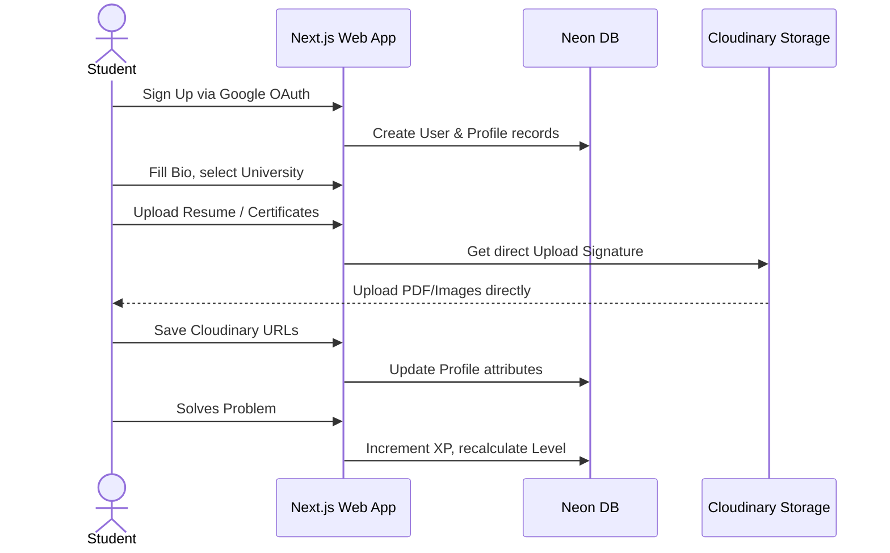
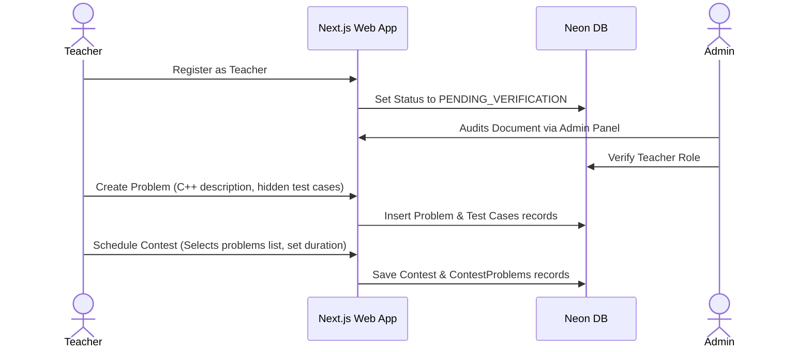
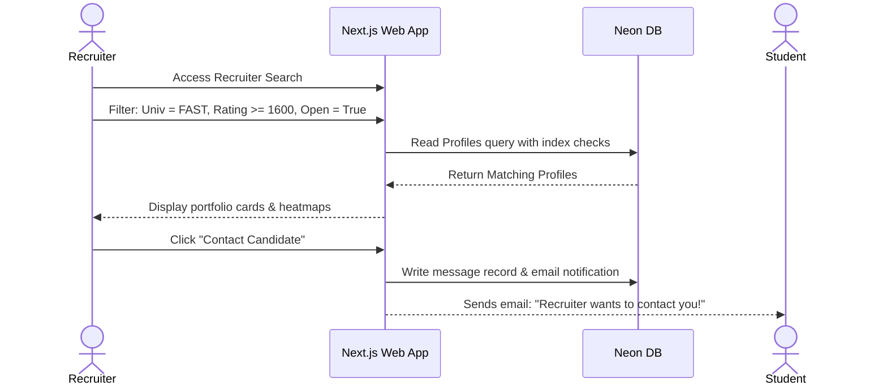
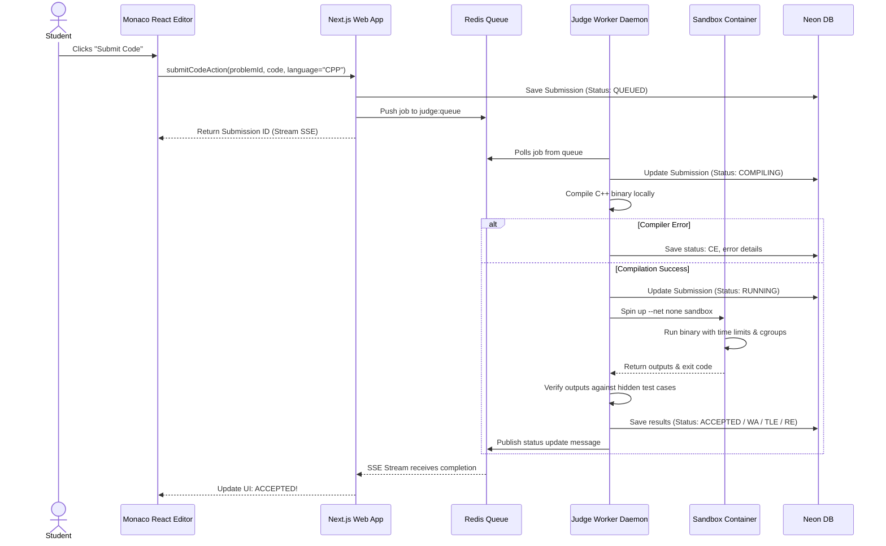

# Roadmaps & Flow Diagrams
## Project Name: "StudyMikey"
**Version**: 1.0.0  
**Author**: Staff DevOps Engineer, Product Manager, & StudyMikey Founder  
**Date**: June 3, 2026

---

## 1. MVP Development Roadmap

This phased roadmap aligns your build priorities with the Next.js fullstack, Neon DB, and Cloudinary tech stack.

```
PHASED ROADMAP EXECUTION TRACK
+------------------------------------------------------------------------------------------------+
|  [PHASE 1: Core Foundation]  --> [PHASE 2: Sandboxed Judge]  --> [PHASE 3: Contests & Social]  |
|  - Auth & Profile Setup          - Worker Daemons Pool           - Live Contests Engine        |
|  - University Directory          - C++ Submission Pipeline        - Ratings Calculation         |
|  - Next.js & Neon DB Init        - Sandbox Resource CGroups      - Recruiter Search & Sourcing |
+------------------------------------------------------------------------------------------------+
```

### Phase 1: Core Foundation & Profiles (Weeks 1 - 4)
1.  **Repository Initialization**: Set up Next.js App Router, configure Drizzle ORM, hook up Neon Serverless DB, and install Tailwind CSS/Shadcn.
2.  **Authentication**: Implement NextAuth.js with Credentials Provider (Email Login) and Google OAuth provider.
3.  **User Profiles & Cloudinary Integration**:
    *   Build the user profile template (`/u/username`) for Students, Teachers, Recruiters, and Admins.
    *   Configure Cloudinary signed upload route handlers to handle user avatar uploads.
4.  **University Directory**: Seed directories with national universities (FAST, NUST, COMSATS, UET). Enable users to link accounts to verified university domains.

### Phase 2: Problems & Sandboxed C++ Judge (Weeks 5 - 8)
1.  **Problem Library Catalog**: Build the problem directory containing metadata filter mechanisms (Tags, difficulty level).
2.  **Editor Panel**: Integrate Monaco Editor with live C++ language support and theme toggling.
3.  **Docker Sandbox Worker**:
    *   Create base C++ compilation docker image.
    *   Deploy daemon polling Redis BullMQ queue.
    *   Implement cgroups (CPU, RAM limits) and execution isolation inside Linux VPC nodes.
4.  **Submission Feed**: Create the `/api/judge/callback` webhook and SSE API route to stream compilation status logs in real-time.

### Phase 3: Contests, Rankings & Social (Weeks 9 - 12)
1.  **Contest Engine**: Build scheduling workflows, the countdown timer, contest problems mapping, and penalization formulas.
2.  **Leaderboards & Ratings**:
    *   Integrate Redis Sorted Sets to cache real-time leaderboard data.
    *   Implement post-contest rating updater routines (Elo/Codeforces formula adjustments).
3.  **Recruiter Portal**: Configure student directory filtering mechanics. Set up outreach modules and resume verification dashboards.
4.  **Mobile App Launch**: Deliver Expo React Native companion client showing contest notifications, roadmaps, and profile metrics.

---

## 2. Production Scaling Roadmap (Post-Launch)

1.  **Auto-scaling Sandbox VM Worker Pools**: Configure AWS Auto Scaling Groups (ASG) or Kubernetes HPA (Horizontal Pod Autoscaler) monitoring Redis `judge:queue` size. Scale VMs out if queue backlog exceeds 100 entries.
2.  **Distributed Caching**: Upgrade standard Redis cache instances to cluster configurations across regions, bringing leaderboard reads closer to global users.
3.  **Advanced Anti-Cheating Analysis**: Integrate MOSS (Measure of Software Similarity) check scripts, triggered automatically upon contest completion, flagging student submissions with similarity thresholds > 85%.
4.  **Continuous Integration & Deployment (CI/CD)**:
    *   Vercel webhook integrations for instant frontend previews.
    *   GitHub Actions workflow compiling Docker judge images, auto-testing compiler sandboxes, and pushing updates to VM registries.

---

## 3. System Workflow Diagrams

### 3.1 Student Registration, Learning, & Profiling



### 3.2 Teacher Contest & Problem Management Flow



### 3.3 Recruiter Talent Search & Sourcing Flow



### 3.4 Secure Code Judge Submission Flow


